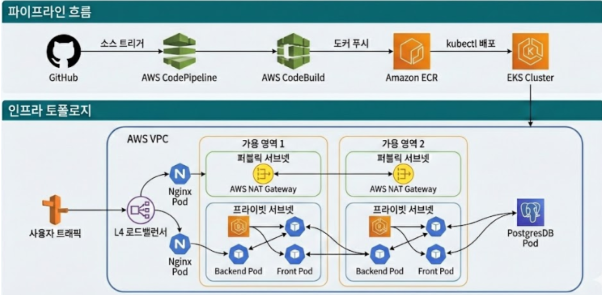

# 나만의 책장 서비스 (도서 관리 서비스)

[📄 포트폴리오 PDF 보기](./.assets/KT%20AIVLE%20School%20Mini%20Project%205.pdf)

*Aivle School 8기 4차 미니 프로젝트*  
**1반 2조**

---

## 📌 프로젝트 개요

**나만의 책장 서비스**는 사용자가 직접 글을 작성해 **나만의 책을 만들고**,  
AI를 활용해 **표지 이미지를 생성**하며,  
YES24에서 가져온 **외부 도서 정보까지 검색**할 수 있는 웹 서비스입니다.

이 프로젝트는 단순한 CRUD 예제에 머무르지 않고,

- 회원가입 / 로그인 기반의 **기본 인증 플로우**
- 사용자가 작성한 책을 등록·조회·수정·삭제하는 **도서 관리 기능**
- Jsoup을 활용한 **YES24 실시간 도서 검색 기능**
- OpenAI를 활용한 **AI 표지 이미지 생성 및 저장 기능**
- AWS EKS 기반의 **클라우드 네이티브 아키텍처**
- CodePipeline / CodeBuild / ECR을 활용한 **무중단 자동 배포(CI/CD)**

까지 한 번에 경험할 수 있도록 설계한 프로젝트입니다.

백엔드와 프론트엔드는 각각 독립된 서버로 동작하며, REST API를 통해 통신합니다.

- **Backend**: Spring Boot (`8080`)
- **Frontend**: Next.js (`3000`)

---

## 🚀 프로젝트 소개

사용자는 이 서비스에서 직접 글을 작성해 자신만의 책을 만들 수 있습니다.  
책 제목, 내용, 저자 정보를 입력해 책을 등록하고,  
수정·삭제·상세 조회까지 가능한 **도서 CRUD 서비스**를 구현했습니다.

또한 단순한 책 등록을 넘어서,  
**OpenAI 이미지 생성 API**를 활용해 책 제목과 내용을 바탕으로  
AI가 표지 이미지를 생성하고, 이를 실제 도서 표지로 저장할 수 있도록 구성했습니다.

여기에 더해 사용자가 관심 있는 책을 검색할 수 있도록  
**YES24 외부 도서 검색 기능**도 추가했습니다.  
사용자가 검색어를 입력하면 백엔드에서 `Jsoup`으로 YES24 검색 결과를 크롤링하고,  
도서 제목 / 저자 / 표지 이미지 / 상세 링크를 파싱해 프론트엔드에 제공합니다.

즉, 이 프로젝트는  
**“내가 직접 책을 만들고 관리하는 기능”** 과  
**“실제 외부 도서 정보를 탐색하는 기능”** 을 결합한 서비스입니다.

---

## 🏗️ 서비스 아키텍처 및 인프라 설계



이 프로젝트는 애플리케이션 기능 구현에 그치지 않고,  
실제 운영 환경을 고려한 **AWS EKS 기반 클라우드 네이티브 아키텍처**로 설계되었습니다.

### 1. 트래픽 분산 구조

외부 요청은 Kubernetes의 `Service(Type: LoadBalancer)`를 통해  
**AWS Load Balancer**로 진입하고,  
이후 내부의 **Nginx**가 프론트엔드/백엔드 라우팅을 수행하도록 구성했습니다.

이를 통해 단일 서버에 트래픽이 집중되지 않도록 분산 처리하고,  
서비스 요청 흐름을 안정적으로 제어할 수 있도록 설계했습니다.

### 2. 고가용성 (High Availability)

특정 노드나 가용 영역에 장애가 발생하더라도  
서비스 전체가 중단되지 않도록 파드들을 분산 배치했습니다.

또한 신규 버전 배포 시 **Rolling Update** 전략을 적용해  
서비스 중단 없이 업데이트가 가능하도록 설계했습니다.

### 3. Self-Healing 구조

Kubernetes의 `Liveness Probe`, `Readiness Probe`를 이용해  
애플리케이션 상태를 지속적으로 점검하고,  
이상이 있는 파드는 자동으로 재시작되도록 구성했습니다.

### 4. Auto Scaling

트래픽이 증가할 경우 유연하게 대응할 수 있도록  
**Cluster Autoscaler**를 활용해 노드 확장 구조를 고려했습니다.

### 5. 데이터 영속성 및 보안

도서 데이터와 사용자 정보는 휘발되지 않도록  
**PostgreSQL + AWS EBS 기반 영속 스토리지** 구조를 사용했습니다.

또한 DB 계정과 같은 민감 정보는  
Kubernetes `Secret`을 활용해 안전하게 주입하도록 구성했습니다.

---

## 🔄 무중단 자동 배포 파이프라인 (CI/CD)

이 프로젝트는 수동 배포 과정에서 발생할 수 있는 실수를 줄이고,  
개발 생산성을 높이기 위해 **AWS 네이티브 CI/CD 파이프라인**을 구성했습니다.

### 파이프라인 동작 흐름

1. **Source**
   - GitHub `main` 브랜치에 코드가 Push되면 CodePipeline이 이를 감지합니다.

2. **Build**
   - CodeBuild가 `buildspec.yml` 설정에 따라 프론트엔드와 백엔드를 각각 Docker 이미지로 빌드합니다.

3. **Push**
   - 빌드된 이미지는 AWS ECR에 업로드됩니다.

4. **Deploy**
   - 최신 이미지를 기반으로 EKS 클러스터에 배포되며, Rolling Update 방식으로 **무중단 반영**됩니다.

### 설계 포인트

- 별도의 Jenkins 서버 없이 **AWS 관리형 서비스만으로 CI/CD 구성**
- Git 커밋 해시 기반 버전 관리로 **롤백 가능성 확보**
- 운영 환경과 가까운 구조를 통해 **실서비스 배포 흐름 경험**

---

## ✨ 주요 기능

### 1. 사용자 인증 및 관리

- **회원가입**
  - 이메일, 비밀번호, 닉네임, 전화번호 입력
  - 이메일 중복 체크
  - 비밀번호 정책 검증
  - 입력값 유효성 검사 및 예외 메시지 반환

- **로그인**
  - 이메일 + 비밀번호 기반 로그인
  - 성공 시 `HttpSession`에 사용자 정보 저장
  - 세션 기반 사용자 식별 구조

- **확장 고려**
  - 로그아웃
  - 아이디 / 비밀번호 찾기
  - 비밀번호 재설정 기능까지 확장 가능한 형태로 설계

### 2. 나만의 책 만들기 (도서 CRUD)

- **도서 등록**
  - 제목, 내용, 저자, 기본 표지 URL 입력 가능
- **도서 목록 조회**
  - 사용자가 작성한 책 목록을 카드 형태로 확인
- **도서 상세 조회**
  - 책 내용, 표지, 생성일/수정일 확인
- **도서 수정**
  - 제목, 내용, 표지 이미지 수정 가능
- **도서 삭제**
  - 불필요한 도서 삭제 가능

이 과정에서 사용자가 직접 만든 책에  
**AI 표지 생성 기능**까지 연결해 실제 도서처럼 꾸밀 수 있도록 했습니다.

### 3. YES24 도서 검색

- 사용자가 검색어 입력
- 백엔드에서 YES24 검색 결과 페이지를 `Jsoup`으로 크롤링
- **도서 제목 / 저자 / 표지 이미지 / 상세 링크** 파싱
- 프론트엔드에서 검색 결과 리스트 렌더링

이를 통해 사용자는  
**내가 만든 책**과 **실제 서점 도서 정보**를 함께 탐색할 수 있습니다.

### 4. AI 표지 이미지 생성

도서 상세 페이지에서 사용자는  
**OpenAI 이미지 생성 API**를 통해 책 표지를 생성할 수 있습니다.

#### 동작 흐름

1. 사용자가 도서 상세 페이지에서 **“AI 표지 생성”** 버튼 클릭
2. 필요 시 본인의 **OpenAI API Key** 입력
3. 프론트엔드에서 도서 제목/내용을 기반으로 프롬프트 생성
4. `fetch`를 사용해 OpenAI 이미지 생성 API 호출
5. 응답으로 받은 **이미지 URL**을 화면에 미리보기 표시
6. 사용자가 **“이 이미지를 표지로 저장”** 선택
7. 백엔드 `PATCH /book/createImg/{bookId}` 호출
8. 해당 도서의 `coverImageUrl` 필드 업데이트 후 DB 반영

#### UX 처리

- 생성 중 로딩 상태 표시
- 실패 시 에러 메시지 출력
- 기존 표지를 유지하여 사용자 경험 보완

---

## 🛠 기술 스택

### Infrastructure & DevOps

- **AWS EKS**
- **AWS ECR**
- **AWS Load Balancer**
- **AWS IAM**
- **AWS EBS**
- **AWS CodePipeline**
- **AWS CodeBuild**
- **Kubernetes**
  - Deployment
  - StatefulSet
  - Service
  - ConfigMap
  - Secret
- **Cluster Autoscaler**

### Backend

- **Java 17**
- **Spring Boot 3.5.8**
- **Spring Web**
- **Spring Data JPA**
- **Hibernate**
- **H2 Database** (개발 환경)
- **PostgreSQL** (운영/배포 환경)
- **Jsoup**
- **Lombok**
- **Gradle**

### Frontend

- **Next.js**
- **React Hooks**
- **MUI**
- **Axios**
- **fetch**

---

## 📂 프로젝트 구성

> 실제 레포 구조에 맞게 폴더명은 수정해서 사용하세요.

```bash
project-root/
├─ backend/
│  ├─ src/main/java/...
│  ├─ src/main/resources/...
│  └─ build.gradle
├─ frontend/
│  ├─ app/ or pages/
│  ├─ components/
│  ├─ package.json
│  └─ ...
├─ k8s/
│  ├─ deployment.yaml
│  ├─ service.yaml
│  ├─ ingress or nginx 설정
│  ├─ postgres-statefulset.yaml
│  └─ secret/configmap.yaml
├─ .assets/
│  ├─ system_architec.png
│  └─ KT AIVLE School Mini Project 5.pdf
└─ README.md
```

---

## 🔌 핵심 API 요약

### 사용자 인증

- `POST /user/join` : 회원가입
- `POST /user/login` : 로그인

### 도서 관리

- `GET /book/list` : 내 도서 목록 조회
- `GET /book/detail/{id}` : 도서 상세 조회
- `POST /book/insert` : 도서 등록
- `PUT /book/update/{id}` : 도서 수정
- `DELETE /book/delete/{id}` : 도서 삭제
- `PATCH /book/createImg/{bookId}` : AI 표지 이미지 URL 저장

### 외부 도서 검색

- `GET /books/search?query={keyword}` : YES24 도서 검색

---

## 🧪 구현 포인트

### 1. 기능 구현 + 서비스 흐름 연결

단순 CRUD 구현에 그치지 않고,  
사용자 인증 → 도서 관리 → 외부 검색 → AI 표지 생성까지  
하나의 서비스 흐름으로 연결했습니다.

### 2. 외부 서비스 연동 경험

- YES24 HTML 크롤링
- OpenAI 이미지 생성 API 연동
- 외부 API / 외부 웹 데이터 활용 경험 확보

### 3. 실서비스형 인프라 경험

- EKS 기반 배포
- 컨테이너화
- 무중단 배포
- 오토스케일링 고려
- 헬스체크 및 셀프힐링 구조 설계

### 4. 프론트/백 분리형 구조

프론트엔드와 백엔드를 독립적으로 구성하고  
REST API로 통신하도록 설계해  
실제 협업 및 서비스 개발 방식에 가깝게 구현했습니다.

---

## 🙋 담당 역할

> 팀 프로젝트

프로젝트 기능 기획 및 요구사항 정리

도서 CRUD 백엔드 API 설계 및 구현

Book 엔티티 및 DB 구조 설계

Spring Boot / JPA 기반 서비스 계층 구성

API 응답 구조 설계 및 Postman 테스트

프론트엔드 연동을 위한 데이터 흐름 설계
---

## 🎯 프로젝트 의의

이 프로젝트는 단순히 도서 정보를 저장하는 애플리케이션이 아니라,  
**사용자 제작 콘텐츠 + 외부 도서 정보 + AI 생성 기능 + 클라우드 인프라 운영**을  
하나의 서비스 안에 통합한 프로젝트입니다.

기능 구현뿐 아니라,  
실제 서비스 운영 환경을 고려한 배포 구조와 인프라 설계까지 경험했다는 점에서  
의미가 있는 프로젝트입니다.

즉,  
**“웹 애플리케이션 기능 개발”** 과  
**“클라우드 네이티브 운영 환경 설계”** 를 함께 경험한 프로젝트라고 볼 수 있습니다.

---

## 🚧 개선 방향

- Spring Security / JWT 기반 인증 구조로 고도화
- OpenAI 프롬프트 옵션 세분화
- 생성 이미지 히스토리 저장 기능 추가
- 도서 카테고리 / 태그 기능 확장
- 검색 결과 캐싱 처리
- 사용자별 마이페이지 강화
- 모니터링(CloudWatch / Prometheus / Grafana) 연동 고도화
- 배포 파이프라인에 테스트 자동화 단계 추가

---

## ▶ 실행 방법 (로컬 개발 환경)

### Backend

```bash
cd backend
./gradlew bootRun
```

### Frontend

```bash
cd frontend
npm install
npm run dev
```

기본 실행 주소

- Frontend: `http://localhost:3000`
- Backend: `http://localhost:8080`

---

## 📬 참고 자료

- 포트폴리오 PDF: [KT AIVLE School Mini Project 5](./.assets/KT%20AIVLE%20School%20Mini%20Project%205.pdf)

---

## 📎 한 줄 요약

**AI 표지 생성, 외부 도서 검색, 사용자 맞춤 도서 CRUD를 제공하는 웹 서비스이며, AWS EKS 기반 클라우드 네이티브 아키텍처와 무중단 CI/CD 파이프라인까지 함께 경험한 프로젝트입니다.**
